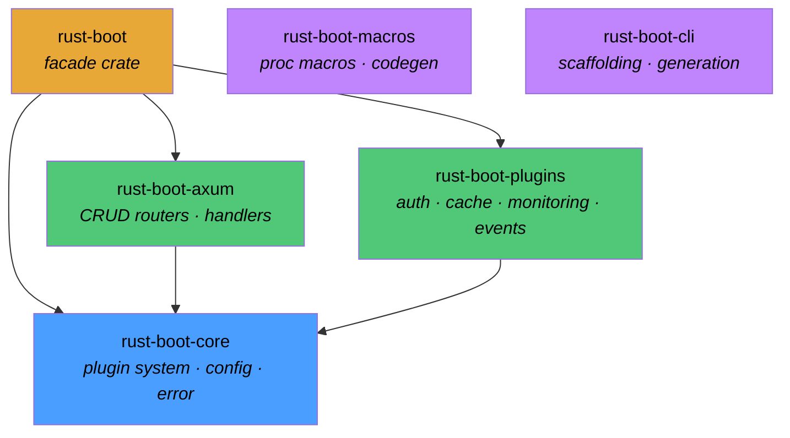
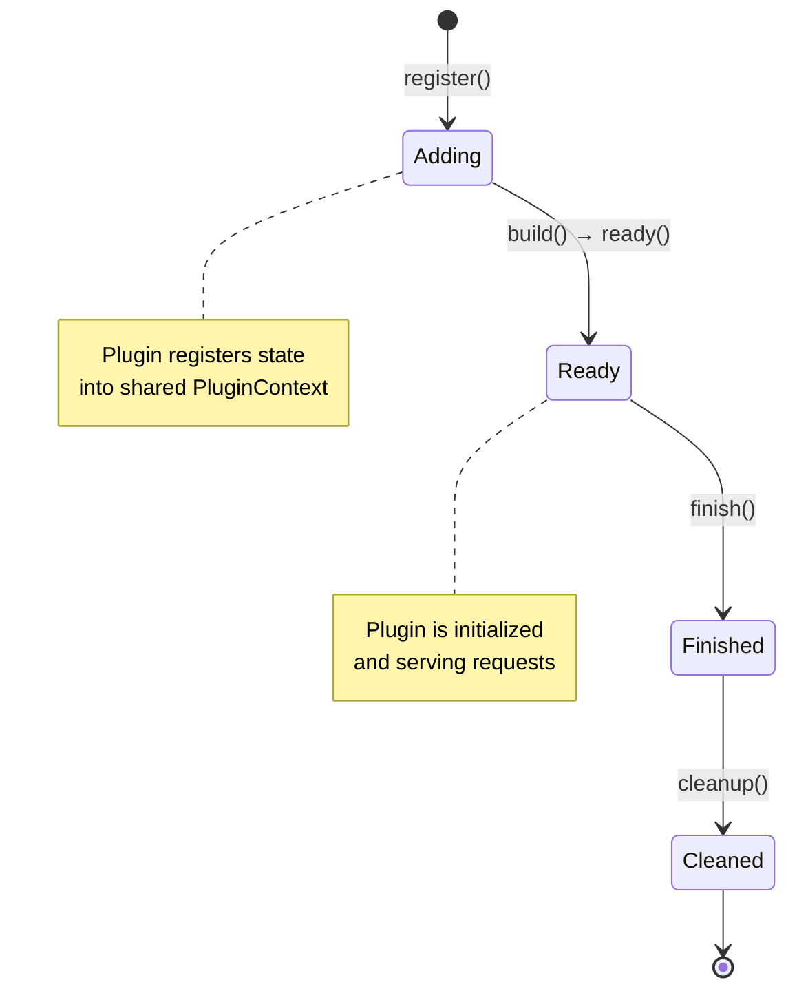
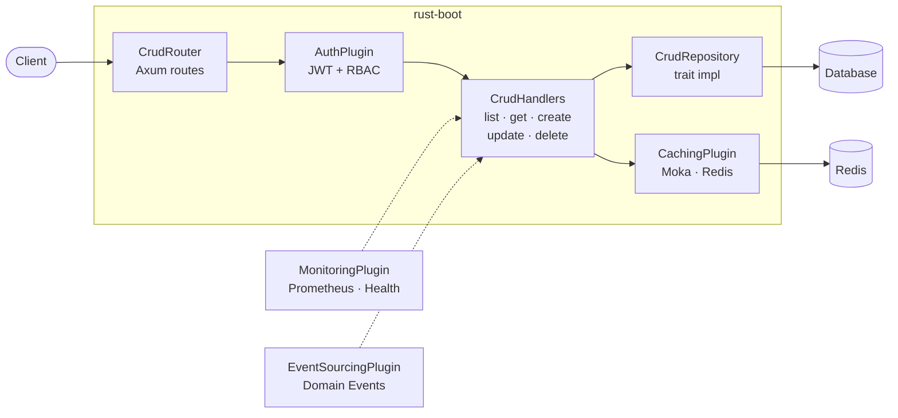

# Architecture Overview

rust-boot is a batteries-included CRUD API framework for Rust, inspired by Spring Boot. It is organized as a Cargo workspace containing six specialized crates, each with a clear responsibility. This page provides a high-level view of how the crates relate to each other, how plugins move through their lifecycle, and how an HTTP request flows through the framework.

## Crate Dependency Graph

The workspace is split into a thin facade crate (`rust-boot`) that re-exports the public API, a foundational core crate, two feature crates (Axum integration and plugins), and two standalone tooling crates (macros and CLI).

The arrows represent compile-time `Cargo.toml` dependencies:

- **rust-boot** (the facade) depends on `rust-boot-core`, `rust-boot-axum`, and `rust-boot-plugins`. It re-exports their public types through a unified `prelude` module so that application code only needs a single `use rust_boot::prelude::*;` import.
- **rust-boot-axum** depends on `rust-boot-core` because it uses the core error types, repository traits, and service abstractions to build its CRUD handlers.
- **rust-boot-plugins** depends on `rust-boot-core` because every plugin implements the `CrudPlugin` trait defined in core and uses the shared `PluginContext`.
- **rust-boot-macros** and **rust-boot-cli** are standalone. The macros crate is a proc-macro crate that generates SeaORM entities and DTOs at compile time. The CLI crate is a binary that scaffolds new projects using Tera templates.

## Plugin Lifecycle

Every plugin in rust-boot implements the `CrudPlugin` trait and follows a four-state lifecycle managed by the `PluginRegistry`. The registry resolves dependencies between plugins using topological sorting (Kahn's algorithm) and drives each plugin through the states in the correct order.

The lifecycle works as follows:

1. **Adding** — The plugin is registered with the `PluginRegistry` via `registry.register(plugin)`. At this point the registry validates that no duplicate names exist and records the plugin's metadata (name, version, dependencies). The plugin has not yet been initialized.

2. **Ready** — The registry calls `init_all()`, which resolves the topological order of all registered plugins and then calls `build()` followed by `ready()` on each plugin in dependency order. During `build()`, plugins typically create their internal resources and store them in the shared `PluginContext`. For example, `AuthPlugin::build()` creates a `JwtManager` and inserts it into the context. During `ready()`, plugins perform any final setup such as installing a Prometheus metrics recorder.

3. **Finished** — When the application is shutting down, the registry calls `finish_all()`, which invokes `finish()` on each plugin in *reverse* dependency order. This gives plugins a chance to flush buffers, close connections, or persist state.

4. **Cleaned** — Finally, `cleanup_all()` calls `cleanup()` on each plugin in reverse order. Plugins release all resources and remove their entries from the `PluginContext`. After this step the plugin is fully torn down.

State transitions are enforced by the `PluginState` enum, which provides `next()` and `can_transition_to()` methods. Only forward transitions along the lifecycle are allowed — a plugin cannot go from `Ready` back to `Adding`.

## Request Flow

When a client sends an HTTP request to a rust-boot application, it passes through several layers before reaching the database. Each layer is provided by a different crate or plugin.

Step by step:

1. **Router** (`rust-boot-axum`) — The `CrudRouterBuilder` maps HTTP methods to handler functions. A typical configuration registers `GET /`, `GET /:id`, `POST /`, `PUT /:id`, `DELETE /:id`, and optionally `PATCH /:id/restore` for soft-delete support. The builder nests all routes under a configurable base path (e.g., `/api/users`).

2. **Authentication** (`rust-boot-plugins::auth`) — If the `AuthPlugin` is registered, requests pass through JWT verification. The `JwtManager` validates the token signature, checks expiration, and extracts `Claims` containing the user's roles. Role-based access control (RBAC) is enforced by checking `has_role()`, `has_any_role()`, or `has_all_roles()` on the claims.

3. **Handler** (`rust-boot-axum::handlers`) — The handler function receives the validated request and delegates to the service/repository layer. Handlers use the response helpers (`ok()`, `created()`, `no_content()`, `paginated()`) to produce consistent JSON responses wrapped in `ApiResponse<T>` or `PaginatedResponse<T>`.

4. **Repository** (`rust-boot-core::repository`) — The `CrudRepository` trait provides the data access abstraction. It defines `insert`, `find_by_id`, `find_all`, `find_with_filter`, `update`, `delete`, `count`, and `exists` methods. Implementations use `DatabaseConnection` and `Transaction` traits for transactional operations.

5. **Caching** (`rust-boot-plugins::cache`) — The `CachingPlugin` provides a `CacheBackend` trait with `get`, `set`, `delete`, `exists`, and `clear` operations. Two backends are included: `MokaBackend` for high-performance in-memory caching and `RedisBackend` for distributed caching.

6. **Monitoring** (`rust-boot-plugins::monitoring`) — The `MonitoringPlugin` records Prometheus metrics for every request (method, path, status code, duration) via `MetricsRecorder::record_request()`. Health checks are aggregated through the `HealthCheck` trait and exposed for Kubernetes liveness/readiness probes.

7. **Event Sourcing** (`rust-boot-plugins::events`) — The `EventSourcingPlugin` captures domain events (`Created`, `Updated`, `Deleted`, `Restored`) through the `EventStore` trait. Events are wrapped in `EventEnvelope<E>` with rich metadata including correlation and causation IDs for distributed tracing.

## Design Principles

- **Plugin-first architecture** — Every cross-cutting concern (auth, caching, monitoring, events) is a plugin that implements `CrudPlugin`. This keeps the core small and lets applications opt in to only the features they need.
- **Trait-based abstractions** — The framework defines traits (`CrudRepository`, `CrudService`, `CacheBackend`, `EventStore`, `HealthCheck`) rather than concrete implementations, making it easy to swap backends.
- **Thread safety by default** — All traits require `Send + Sync`. Shared state uses `Arc<RwLock<>>` for safe concurrent access.
- **Builder patterns everywhere** — Configuration, routing, JWT config, and plugin metadata all use the builder pattern for ergonomic, type-safe construction.
- **Layered configuration** — Settings are loaded with clear precedence: defaults < config file (TOML/YAML/JSON) < environment variables (`RUST_BOOT_*` prefix), following twelve-factor app methodology.
