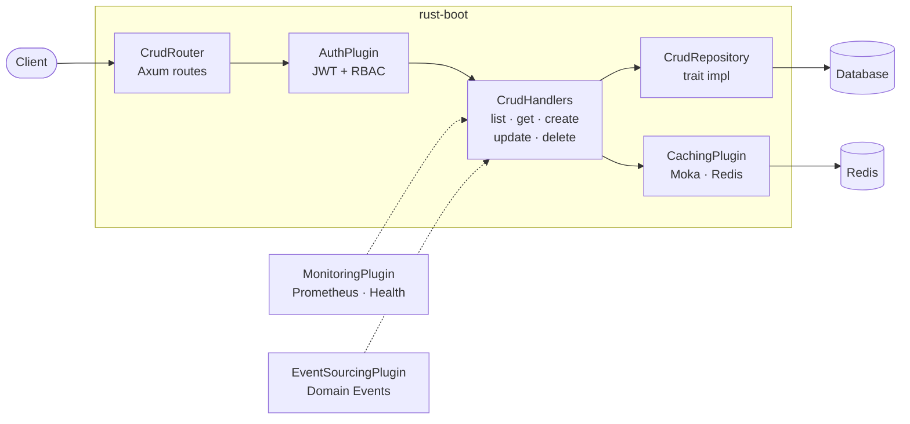

# Request Flow

This page traces the path of an HTTP request through a rust-boot application, from the moment it arrives at the server to the moment a response is sent back to the client. Understanding this flow helps you reason about where to add middleware, how plugins interact with request handling, and where your application logic fits in.

## High-Level Overview



The solid arrows represent the primary request path. The dashed arrows represent cross-cutting concerns (monitoring and events) that observe or react to handler activity without being directly in the request chain.

## Layer by Layer

### 1. TCP Listener and Axum Server

Every rust-boot application starts with a Tokio TCP listener bound to a host and port. Axum's `serve()` function accepts incoming connections and dispatches them to the router.

```rust
let listener = tokio::net::TcpListener::bind("0.0.0.0:3000").await?;
axum::serve(listener, app).await?;
```

At this level, the request is raw HTTP. Axum parses the HTTP method, path, headers, and body before passing the request into the routing layer.

### 2. Router Dispatch (CrudRouterBuilder)

The `CrudRouterBuilder` generates an Axum `Router` that maps HTTP method + path combinations to handler functions. When a request arrives, Axum matches it against the registered routes.

For a router configured like this:

```rust
let router = CrudRouterBuilder::<AppState>::new(CrudRouterConfig::new("/api/users"))
    .list(list_users)       // GET    /api/users
    .get(get_user)          // GET    /api/users/:id
    .create(create_user)    // POST   /api/users
    .update(update_user)    // PUT    /api/users/:id
    .delete(delete_user)    // DELETE /api/users/:id
    .build();
```

The routing table looks like:

| HTTP Method | Path Pattern | Handler |
|---|---|---|
| `GET` | `/api/users` | `list_users` |
| `GET` | `/api/users/:id` | `get_user` |
| `POST` | `/api/users` | `create_user` |
| `PUT` | `/api/users/:id` | `update_user` |
| `DELETE` | `/api/users/:id` | `delete_user` |

If `with_soft_delete()` is enabled and a `restore` handler is registered, an additional route is added:

| HTTP Method | Path Pattern | Handler |
|---|---|---|
| `PATCH` | `/api/users/:id/restore` | `restore_user` |

Under the hood, `CrudRouterBuilder` uses Axum's `Router::route()` and `Router::nest()` methods. The `build()` method nests all routes under the configured `base_path`, so the handler functions themselves only see relative paths (`/` and `/:id`).

If no route matches, Axum returns a 404 response automatically — your handler code is never invoked.

### 3. Middleware Layer (Tower)

Between the router and your handler, Tower middleware can intercept the request. rust-boot uses `tower-http` for common middleware like tracing and CORS:

```rust
use tower_http::trace::TraceLayer;
use tower_http::cors::CorsLayer;

let app = Router::new()
    .merge(users_router)
    .layer(TraceLayer::new_for_http())
    .layer(CorsLayer::permissive())
    .with_state(state);
```

Middleware executes in the order it is layered — the last `.layer()` call wraps the outermost layer. A request passes through middleware top-down, and the response passes back through bottom-up.

### 4. Extractors

Before your handler function runs, Axum extracts typed data from the request using extractors. rust-boot handlers commonly use these extractors:

- `State<AppState>` — Shared application state (plugin references, database pools, etc.)
- `Path<Uuid>` — Path parameters like `:id`
- `Query<PaginationQuery>` — Query string parameters (`?page=1&per_page=20`)
- `Json<CreateDto>` — Deserialized JSON request body

```rust
async fn get_user(
    axum::extract::State(state): axum::extract::State<AppState>,
    axum::extract::Path(id): axum::extract::Path<Uuid>,
) -> ApiResult<User> {
    // state and id are already extracted and typed
    // ...
}
```

If extraction fails (e.g., invalid UUID in the path, malformed JSON body), Axum returns an appropriate 4xx error before your handler code runs.

### 5. Handler Execution

The handler function is where your application logic lives. It receives the extracted data, performs business operations, and returns a response.

rust-boot provides response helper functions that wrap your data in standardized envelopes:

| Helper | HTTP Status | Return Type | Use Case |
|---|---|---|---|
| `ok(data)` | 200 OK | `ApiResult<T>` | Single-item responses |
| `created(data)` | 201 Created | `(StatusCode, Json<ApiResponse<T>>)` | After creating a resource |
| `no_content()` | 204 No Content | `StatusCode` | After deleting a resource |
| `paginated(data, page, per_page, total)` | 200 OK | `PaginatedResult<T>` | List endpoints |

The response types ensure a consistent JSON structure across all endpoints:

```json
// Single item (ok / created)
{
  "data": { "id": "...", "name": "...", "email": "..." }
}

// Paginated list
{
  "data": [{ ... }, { ... }],
  "page": 1,
  "per_page": 20,
  "total": 42,
  "total_pages": 3
}

// Error
{
  "error": "not_found",
  "message": "User not found",
  "details": null
}
```

### 6. Plugin Interactions During Request Handling

Plugins are not middleware in the traditional sense — they are initialized at startup and provide services that handlers consume through the application state. Here is how each plugin typically participates in request handling:

#### AuthPlugin (JWT + RBAC)

The `JwtManager` is stored in `AppState` and used by handlers (or middleware) to verify tokens and check roles:

```rust
async fn protected_handler(
    State(state): State<AppState>,
    headers: axum::http::HeaderMap,
) -> ApiResult<SomeData> {
    // Extract and verify the JWT from the Authorization header
    let token = headers.get("Authorization")
        .and_then(|v| v.to_str().ok())
        .and_then(|v| v.strip_prefix("Bearer "));

    let claims = state.jwt_manager.verify_access_token(token.unwrap())?;

    // Check roles
    if !claims.has_role(&Role::admin()) {
        return Err(ApiError::new("forbidden", "Admin access required"));
    }

    // Proceed with the request...
}
```

#### CachingPlugin (Moka / Redis)

The cache backend is accessed through `AppState` to store and retrieve frequently accessed data:

```rust
async fn get_user(
    State(state): State<AppState>,
    Path(id): Path<Uuid>,
) -> ApiResult<User> {
    let cache_key = format!("user:{id}");

    // Check cache first
    if let Some(bytes) = state.cache.get(&cache_key).await? {
        let user: User = serde_json::from_slice(&bytes)?;
        return ok(user);
    }

    // Cache miss — fetch from database
    let user = fetch_user_from_db(id).await?;

    // Store in cache for next time
    let bytes = serde_json::to_vec(&user)?;
    state.cache.set(&cache_key, bytes, Some(Duration::from_secs(300))).await?;

    ok(user)
}
```

#### MonitoringPlugin (Prometheus)

The `MetricsRecorder` tracks request counts, latencies, and custom gauges. It can be used in middleware or directly in handlers:

```rust
// Record a request metric
metrics_recorder.record_request("GET", "/api/users", 200, duration);

// Increment a custom counter
metrics_recorder.increment_counter("users_created_total", 1);
```

#### EventSourcingPlugin

Domain events can be emitted from handlers to record state changes:

```rust
// After creating a user, emit a domain event
let event = CrudEvent::Created(user.clone());
event_store.append("user", &EventEnvelope::new(event, metadata)).await?;
```

### 7. Error Handling

When something goes wrong, handlers return an `ApiError` which implements Axum's `IntoResponse` trait. The error code is mapped to an HTTP status code:

| Error Code | HTTP Status |
|---|---|
| `not_found` | 404 Not Found |
| `bad_request` | 400 Bad Request |
| `validation_error` | 422 Unprocessable Entity |
| `conflict` | 409 Conflict |
| `unauthorized` | 401 Unauthorized |
| `forbidden` | 403 Forbidden |
| (anything else) | 500 Internal Server Error |

```rust
// Returning an error from a handler
async fn get_user(Path(id): Path<Uuid>) -> ApiResult<User> {
    let user = find_user(id).await
        .ok_or_else(|| ApiError::not_found("User"))?;
    ok(user)
}
```

The `RustBootError` type from the core crate covers framework-level errors (config, database, plugin, cache, auth, etc.), while `ApiError` is specifically for HTTP responses. You typically convert between them at the handler boundary.

### 8. Response Serialization

Once the handler returns, Axum serializes the response:

1. The return type (e.g., `Json<ApiResponse<User>>`) is converted to an HTTP response via `IntoResponse`.
2. Serde serializes the struct to JSON bytes.
3. Axum sets the `Content-Type: application/json` header.
4. The response passes back through any middleware layers (in reverse order).
5. The response bytes are written to the TCP connection and sent to the client.

## Complete Request Lifecycle

Putting it all together, here is the full lifecycle of a `GET /api/users/550e8400-e29b-41d4-a716-446655440000` request:

1. **TCP** — Tokio accepts the connection, Axum parses the HTTP request.
2. **Middleware** — TraceLayer logs the incoming request. CorsLayer adds CORS headers.
3. **Routing** — Axum matches `GET /api/users/:id` to the `get_user` handler.
4. **Extraction** — `State<AppState>` is cloned from the router. `Path<Uuid>` parses `"550e8400-e29b-41d4-a716-446655440000"` into a `Uuid`.
5. **Handler** — `get_user` runs. It checks the cache, queries the database on miss, and returns `ok(user)`.
6. **Response** — `ApiResponse { data: user }` is serialized to JSON. Status 200 is set.
7. **Middleware (reverse)** — TraceLayer logs the response status and latency.
8. **TCP** — The JSON response is written to the connection.

## Customizing the Flow

The request flow is fully customizable because it is built on standard Axum and Tower primitives:

- **Add middleware** — Use `.layer()` on the router to add authentication middleware, rate limiting, request logging, or any Tower service.
- **Compose routers** — Use `.merge()` to combine multiple `CrudRouterBuilder` outputs, or `.nest()` to mount sub-routers at different paths.
- **Disable endpoints** — Use `CrudRouterConfig` methods like `disable_delete()` or `disable_create()` to remove specific CRUD operations.
- **Custom extractors** — Write your own Axum extractors to pull data from headers, cookies, or other request parts.
- **Error mapping** — Implement `From<YourError> for ApiError` to integrate your domain errors with the response system.
