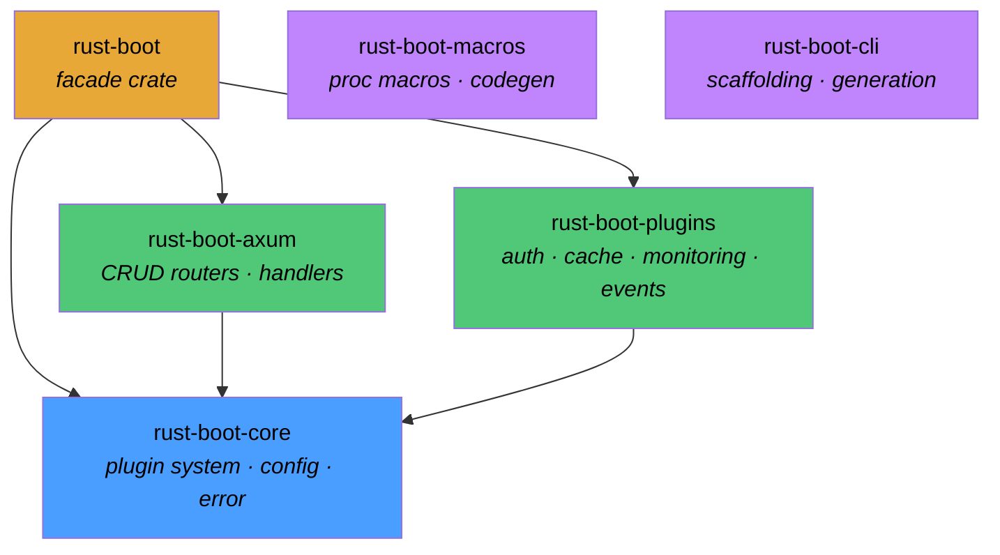

# Introduction

Welcome to the rust-boot documentation. rust-boot is a batteries-included CRUD API framework for Rust, inspired by the developer experience of Spring Boot. It gives you a production-ready foundation for building REST APIs — complete with authentication, caching, monitoring, and event sourcing — so you can focus on your domain logic instead of boilerplate.

The framework is designed around a plugin architecture. Every major capability (auth, caching, metrics, events) is a self-contained plugin that you register at startup. Plugins follow a well-defined lifecycle, are initialized in dependency order, and can be swapped or extended without touching the rest of your application.

## Feature Highlights

| Feature | What it does |
|---|---|
| **Plugin System** | Extensible architecture with lifecycle hooks (init, startup, shutdown). Register only the capabilities you need. |
| **JWT Authentication** | Built-in JWT tokens with Role-Based Access Control (RBAC). Access tokens, refresh tokens, and role checks out of the box. |
| **Caching** | Flexible caching abstraction with Moka (in-memory) and Redis backends. Configurable TTL and capacity limits. |
| **Monitoring** | Integrated Prometheus metrics and customizable health checks. Expose `/metrics` and `/health` endpoints with zero effort. |
| **Event Sourcing** | Domain event system with pluggable event stores. Capture, persist, and replay domain events. |
| **CLI Scaffolding** | Command-line tool for rapid project generation. Scaffold new projects, models, and plugins from templates. |

## Architecture at a Glance

The framework is split into several focused crates. The top-level `rust-boot` crate is a facade that re-exports everything you need through a single dependency. Under the hood, specialized crates handle the core plugin system, Axum integration, built-in plugins, procedural macros, and CLI tooling.



- **rust-boot** — The main facade crate. Add this single dependency to your `Cargo.toml` and you get access to everything.
- **rust-boot-core** — The foundation: plugin trait, plugin registry, configuration management, error types, repository and service traits.
- **rust-boot-axum** — Deep integration with the Axum web framework. Provides `CrudRouterBuilder`, typed handlers, pagination, and API response helpers.
- **rust-boot-plugins** — A collection of ready-to-use plugins for authentication (JWT + RBAC), caching (Moka + Redis), monitoring (Prometheus + health checks), and event sourcing.
- **rust-boot-macros** — Procedural macros for code generation. Derive `CrudModel` to get automatic CRUD operations, DTOs, and entity mappings.
- **rust-boot-cli** — A command-line interface for scaffolding new projects, generating models, and creating custom plugins from templates.

## Quick Example

Here is the shortest path to a working API with rust-boot. Register your plugins, build a router, and start serving:

```rust
use rust_boot::prelude::*;

#[tokio::main]
async fn main() -> RustBootResult<()> {
    // 1. Setup plugins
    let mut registry = PluginRegistry::new();

    registry.register(CachingPlugin::new(CacheConfig::default()))?;
    registry.register(MonitoringPlugin::new(MetricsConfig::default()))?;
    registry.register(AuthPlugin::new(JwtConfig::new("your-secret")))?;

    registry.init_all().await?;

    // 2. Define your API
    let state = AppState { /* ... */ };
    let app = CrudRouterBuilder::<AppState>::new(CrudRouterConfig::new("/api/users"))
        .list(list_users)
        .get(get_user)
        .create(create_user)
        .build()
        .with_state(state);

    // 3. Start server
    let listener = tokio::net::TcpListener::bind("0.0.0.0:3000").await.unwrap();
    axum::serve(listener, app).await.unwrap();

    Ok(())
}
```

Head over to the [Getting Started](./getting-started/overview.md) section to learn more about the framework philosophy, installation, and a complete walkthrough of building your first API.
