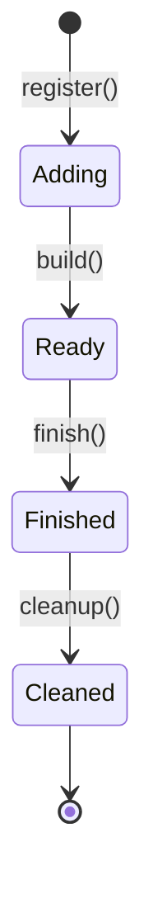
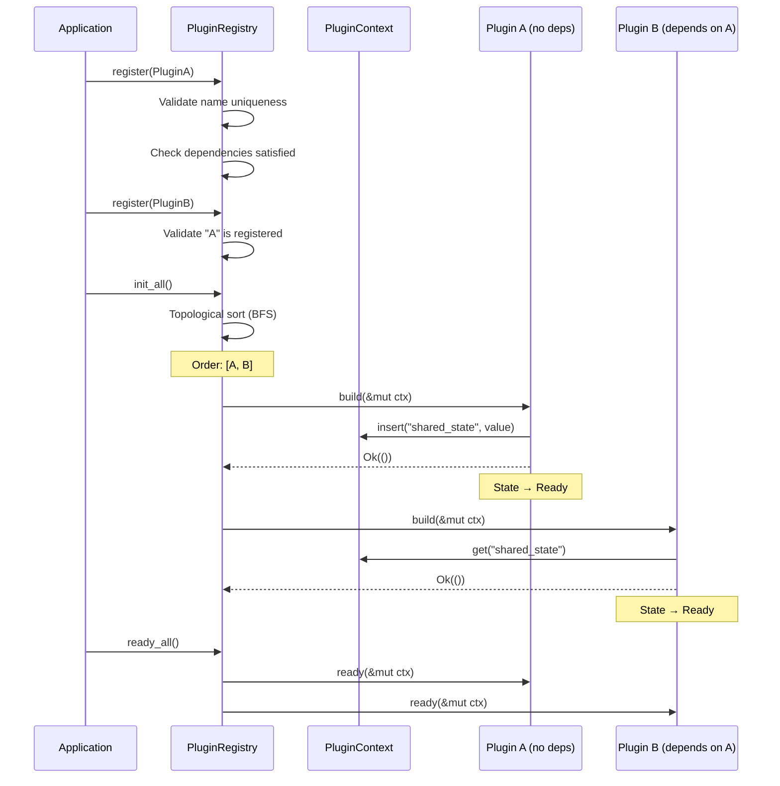

# Plugin Architecture

rust-boot uses a plugin system inspired by [Bevy's](https://bevyengine.org/) approach to modular application composition. Plugins are self-contained units of functionality that hook into a well-defined lifecycle, share state through a thread-safe context, and declare dependencies on each other for automatic initialization ordering.

This page covers the core concepts. For building your own plugins, see [Custom Plugins](./custom-plugins.md).

## Core Components

The plugin system is built on three pillars:

| Component | Role |
|---|---|
| `PluginRegistry` | Central coordinator that manages registration, dependency resolution, and lifecycle orchestration |
| `PluginContext` | Thread-safe shared state container (`Arc<RwLock<HashMap<String, Box<dyn Any + Send + Sync>>>>`) for inter-plugin communication |
| `CrudPlugin` trait | The interface every plugin implements, defining metadata and lifecycle hooks |

## Plugin Lifecycle

Every plugin transitions through four states in a strict, forward-only sequence. The registry drives these transitions by calling the corresponding method on each plugin in dependency order (or reverse dependency order for shutdown).



### Lifecycle Phases

**Adding (build)** — The plugin is registered and its `build()` method is called. This is where you allocate resources, initialize connections, and insert shared state into the `PluginContext`. Plugins are built in topological (dependency) order, so any plugin you depend on is guaranteed to have been built already.

```rust
async fn build(&mut self, ctx: &mut PluginContext) -> Result<()> {
    // Initialize your resources
    let connection_pool = create_pool(&self.config).await?;
    // Share state with other plugins via the context
    ctx.insert("db_pool", Arc::new(connection_pool)).await;
    Ok(())
}
```

**Ready (ready)** — Called after all plugins have been built. Use this for cross-plugin initialization that depends on other plugins' shared state being available. For example, a rate limiter plugin can look up the request counter from the context here.

```rust
async fn ready(&mut self, ctx: &mut PluginContext) -> Result<()> {
    // Access state inserted by another plugin during build()
    let counter: Option<Arc<RequestCounter>> = ctx.get("request_counter").await;
    if counter.is_some() {
        self.enabled = true;
    }
    Ok(())
}
```

**Finished (finish)** — Called during application shutdown in reverse dependency order. Complete any pending work, flush buffers, or send final metrics here.

**Cleaned (cleanup)** — The final phase, also in reverse dependency order. Release all resources, close connections, and remove your entries from the `PluginContext`.

## Plugin Initialization Flow

The following diagram shows the complete flow from registration through initialization:



## Dependency Resolution

The registry uses topological sorting with BFS (Kahn's algorithm) to determine initialization order. Each plugin declares its dependencies through `PluginMeta`:

```rust
fn meta(&self) -> PluginMeta {
    PluginMeta::new("rate-limiter", "1.0.0")
        .with_dependency("request-counter")  // Must be built first
}
```

The algorithm works as follows:

1. Build an in-degree map — count how many dependencies each plugin has
2. Seed a queue with all plugins that have zero in-degree (no dependencies)
3. Process the queue: for each plugin, decrement the in-degree of its dependents; if a dependent reaches zero, add it to the queue
4. If the result contains fewer plugins than registered, a circular dependency exists

The registry validates dependencies at registration time — if you try to register a plugin whose dependency hasn't been registered yet, you get an immediate error:

```rust
let mut registry = PluginRegistry::new();

// This fails because "database" isn't registered yet
let result = registry.register(CachePlugin::with_deps("database"));
assert!(result.is_err()); // "depends on 'database' which is not registered"

// Register in the right order
registry.register(DatabasePlugin::new())?;  // No deps — OK
registry.register(CachePlugin::new())?;     // Depends on database — OK
```

Diamond dependencies (A → B, A → C, B → D, C → D) are handled correctly. Circular dependencies are detected and produce a clear error message listing the involved plugins.

## PluginContext

`PluginContext` is the mechanism for inter-plugin communication. It's a type-erased, thread-safe key-value store backed by `Arc<RwLock<HashMap<String, Box<dyn Any + Send + Sync>>>>`.

```rust
let ctx = PluginContext::new();

// Insert any Send + Sync + 'static type
ctx.insert("db_url", "postgres://localhost/mydb".to_string()).await;
ctx.insert("max_connections", 10u32).await;

// Retrieve with type annotation (returns None on type mismatch)
let url: Option<String> = ctx.get("db_url").await;
let count: Option<u32> = ctx.get("max_connections").await;

// Other operations
ctx.contains("db_url").await;   // true
ctx.remove::<String>("db_url").await;  // Some("postgres://...")
ctx.len().await;                // 1
ctx.is_empty().await;           // false
ctx.clear().await;              // removes everything
```

Because `PluginContext` uses `Arc` internally, cloning it produces a handle to the same underlying state — changes through one handle are visible through all others.

### Best Practices for Context State

- Wrap shared state in `Arc<T>` before inserting so consumers get cheap clones
- Use descriptive, namespaced keys (e.g., `"auth:jwt_manager"` rather than `"manager"`)
- Clean up your entries in `cleanup()` to prevent memory leaks in long-running applications
- Always specify the exact type when calling `get<T>()` — a type mismatch silently returns `None`

## PluginRegistry

The registry is the orchestrator. It owns all registered plugins and the shared context:

```rust
let mut registry = PluginRegistry::new();

// Or start with a pre-populated context
let ctx = PluginContext::new();
ctx.insert("config", app_config).await;
let mut registry = PluginRegistry::with_context(ctx);

// Register plugins
registry.register(CachingPlugin::new(cache_config))?;
registry.register(AuthPlugin::new(jwt_config))?;

// Lifecycle
registry.init_all().await?;    // Calls build() in dependency order
registry.ready_all().await?;   // Calls ready() in dependency order
// ... application runs ...
registry.finish_all().await?;  // Calls finish() in reverse order
registry.cleanup_all().await?; // Calls cleanup() in reverse order

// Inspection
registry.len();                // Number of registered plugins
registry.plugin_names();       // Vec<String> of all names
registry.get("auth");          // Option<&dyn CrudPlugin>
registry.get_state("auth");    // Option<PluginState>
registry.context();            // &PluginContext
```

## Built-in Plugins

rust-boot ships with four production-ready plugins:

| Plugin | Name | Description |
|---|---|---|
| [`AuthPlugin`](./authentication.md) | `"auth"` | JWT authentication with RBAC |
| [`CachingPlugin`](./caching.md) | `"caching"` | Multi-backend caching (Moka, Redis) |
| [`MonitoringPlugin`](./monitoring.md) | `"monitoring"` | Prometheus metrics and health checks |
| [`EventSourcingPlugin`](./events.md) | `"event-sourcing"` | Event sourcing with CQRS support |

## Next Steps

- [Authentication Plugin](./authentication.md) — JWT tokens and role-based access control
- [Caching Plugin](./caching.md) — In-memory and distributed caching
- [Monitoring Plugin](./monitoring.md) — Metrics, health checks, and readiness probes
- [Event Sourcing Plugin](./events.md) — Domain events and event stores
- [Building Custom Plugins](./custom-plugins.md) — Step-by-step tutorial
